# Silsden computer technology community.com

Silsden computer technology community.com is the website for people living in Silsden to support anybody interested in computer technology. Our primary purpose is to open the gate and connect them to the correct link and support. We also introduce computer technology to the community with the event and free study class for the beginner.

The site can be accessed by the link [a link](https://kay13051976.github.io/silsden-computer-tecnology-community.com/)

## User Stories

### First-Time Visitor Goals:

- As a First-Time Visitor, I want to quickly understand the site's primary purpose to learn more about the organization.
- As a first-time visitor, I want to navigate the website to find the content easily.
- As a First Time Visitor, I want to see the testimonials to see whether the organization is trustworthy.
- As a first-time visitor, I want to get in touch easily.

### Returning Visitor Goals:

- I want to see various support choices, events, and courses as a Returning Visitor.
- As a Returning Visitor, I want to see information about technology and link to the appropriate study website and event, support choices, tech career opportunities and make decisions.

### Frequent Visitor Goals:

- As a Frequent User, I want to check for any changes with an available course, event, or computer technology news, IT job requirements
- As a Frequent User, I want options for contacting the organization to get a career opportunity

## wireframes

- Desktop

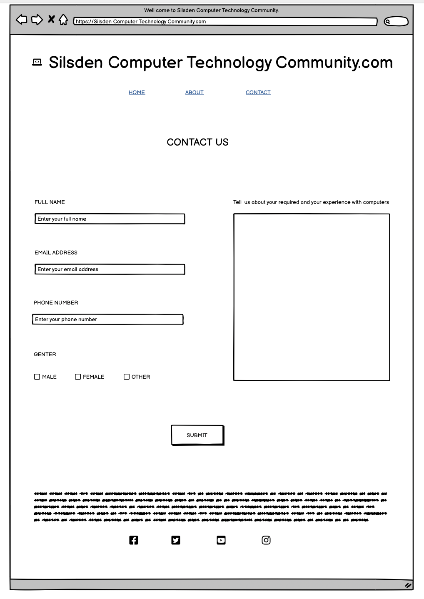
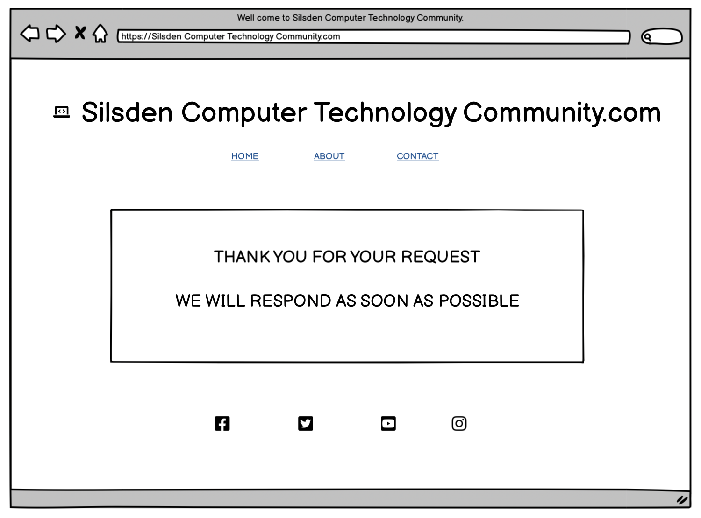

- Mobile

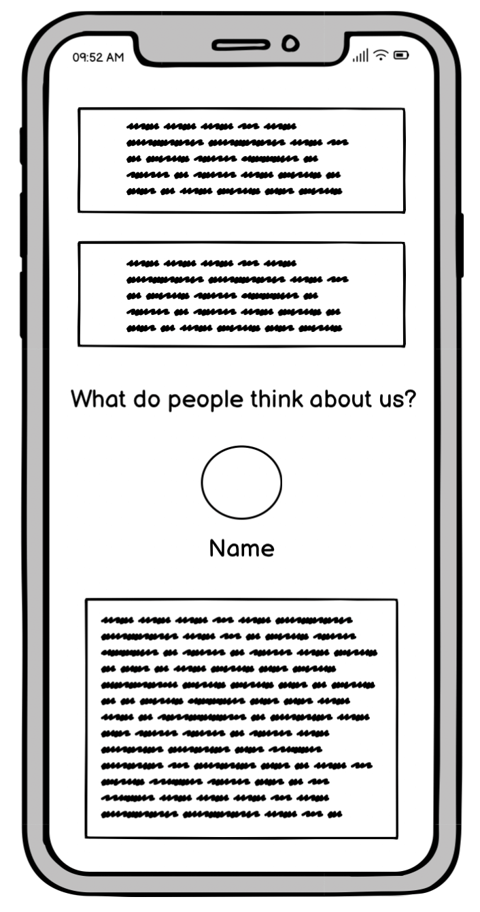

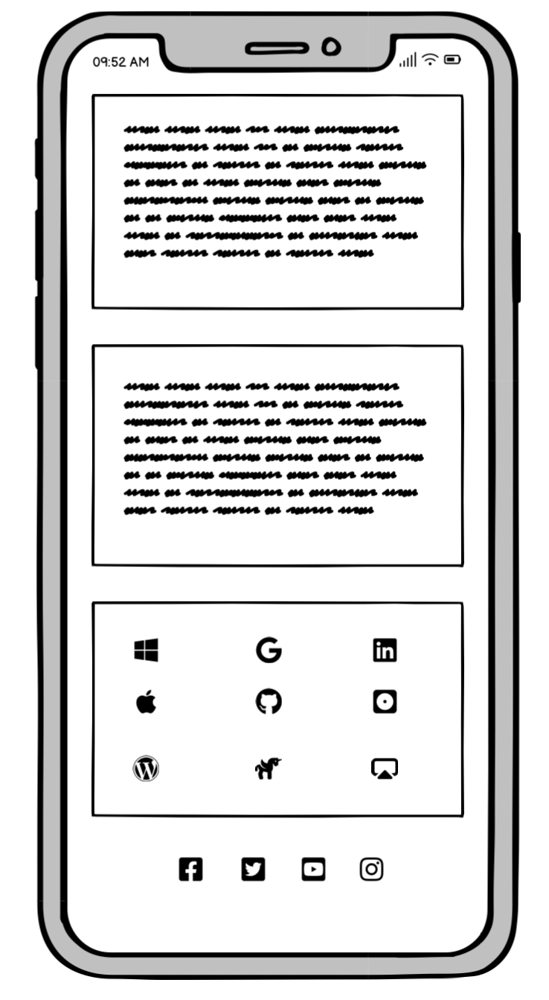

## logo

## features

- navbar

  - navigation
    
    **Position at the top underneath the logo.**

  * Home : Lead to the home page, where the user can learn about the organization.
  * About : Lead to the About page where the user can see the purpose of this organization and all the staff, including the community activities gallery of the years.
  * Contact : Lead to the form page where the user can fill the form to get in touch with the organization

    _The navigation bar is straightforward to understand for the user and responsive_

  - **On laptop**

  
  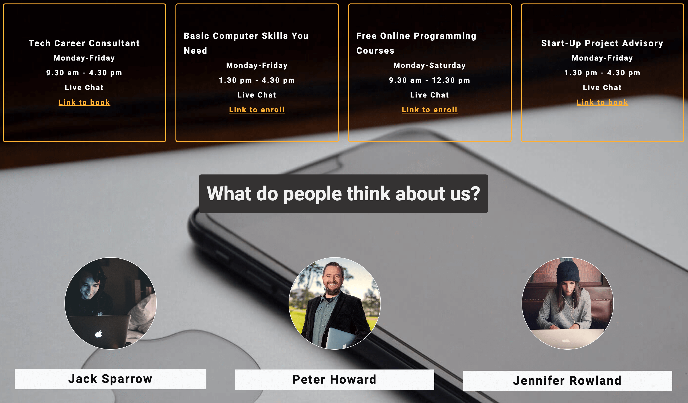
  
  

  - **On mobile devices**
    - navigation bar filled with the logo in the center and a hamburger menu with the links in the same order.

  

  _When the hamburger menu is clicked, there is dropdown menu with the link in the same order._

  

  _The website is responsive when it is on mobile view._

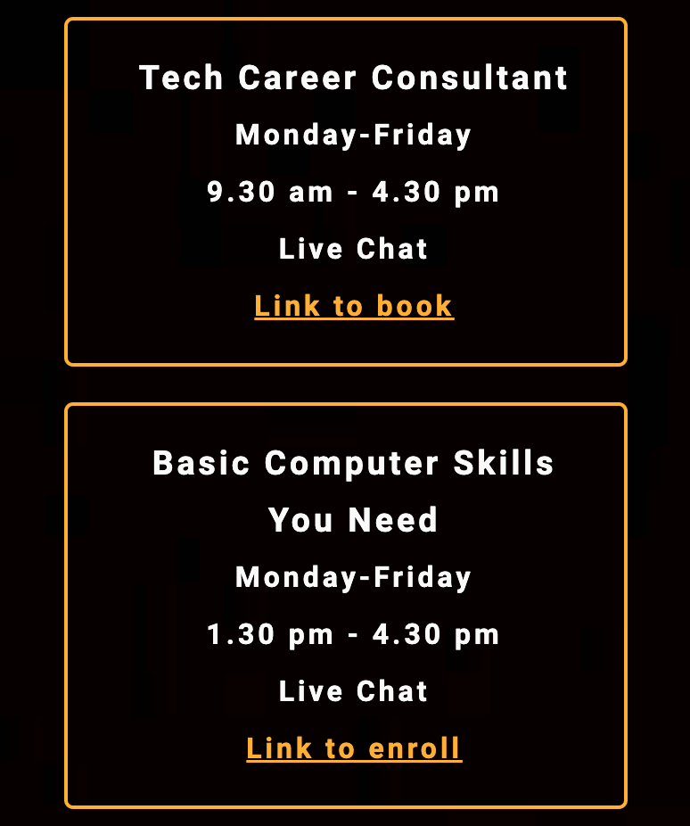
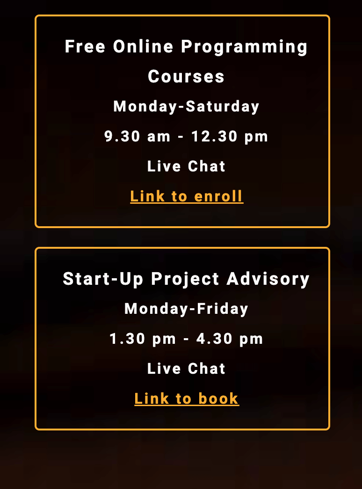
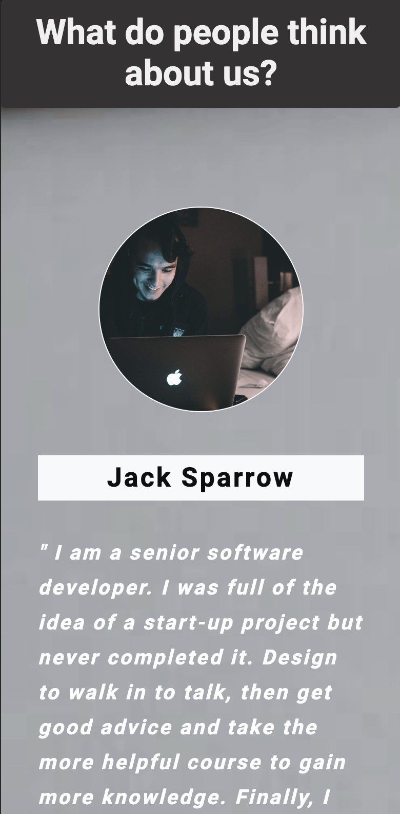

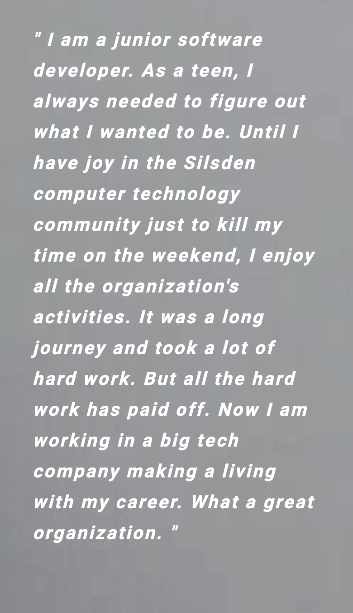
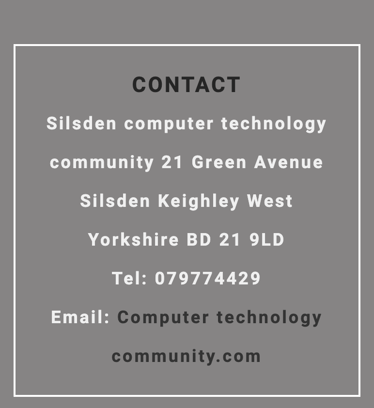

- **On desktop**
  
  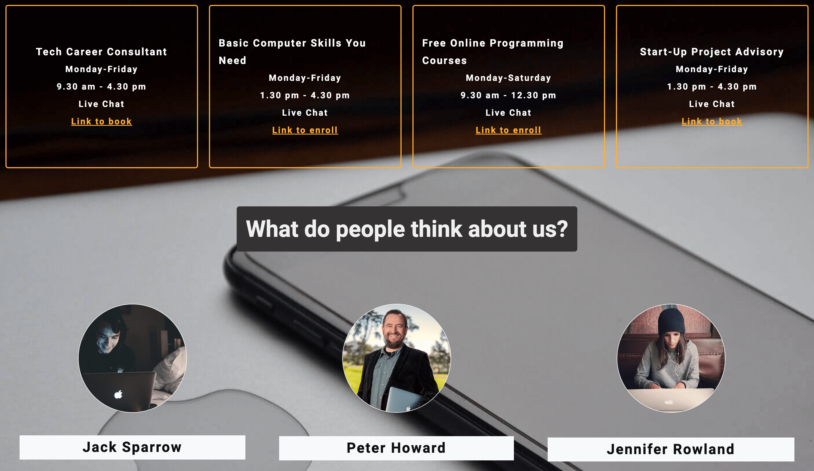
  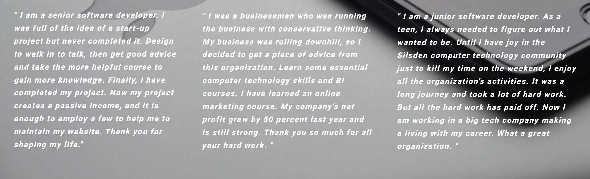
  

## HOME PAGE

 Represent : The home page represents the purpose of the organization and shows feedback from satisfied clients, a weekly agenda, a contact address, and a social link, including sponsored.

- **Header section**
  - Show the logo and the organization name.
  - Show the nav bar, which is nice and clear.

- **Hero image section**
  - The hero section has a fixed background image and text that show the benefit of computer technology.

- **Weekly agenda template section**
  - The agenda template shows the weekly organization event and activities.

- **Testimonials section**
  - The testimonials section show feedback from people who had experience using the Silsden computer technology organization. This Section has three feedbacks. Each card has a name, a story of a client with their image.

- **Contact copyright sponsored section**
  - Show three templates which have information about the contact, copyright and sponsoring, respectively

- **Social link section**
  - The footer contains social media links that open in a new tab.​

## ABOUT PAGE

The About page displays all staff images with the management line. Underneath the organisation chart is the organisation activities picture of the year.

- The About page has a hero image showing all the staff standing together
  underneath is the organisation chart showing the management line, which displays the picture of each one and their name.
- The organisation activities gallery of the year is responsive, and the photo size depends on the user's screen.
- It has a footer social link identical to the home page for the user experience reason and a paragraph about copyright on the top.

## CONTACT PAGE

The contact page has a contact form:

- All text input fields are customized.
- Labels are animated when the input field is focused and not
  empty.
- All inputs are set to be required to fill out.
- The submit button is animated on active.
- The page is responsive on all standard screen sizes.
- The contact form has a big text to fill in and requires a user.
- The contact form has a big textarea to fill in requires and a user experience with computers. The
  textarea can be extended and responsive on all standard screen sizes.
- The submit button leads to the response page.​

## RESPONSE PAGE

The response page appears after submitting the contact form.

- It contains the thank you message and the promise to
  contact the applicant as soon as possible.
- The user can redirect to the home page or about page by clicking on the navbar or logo.

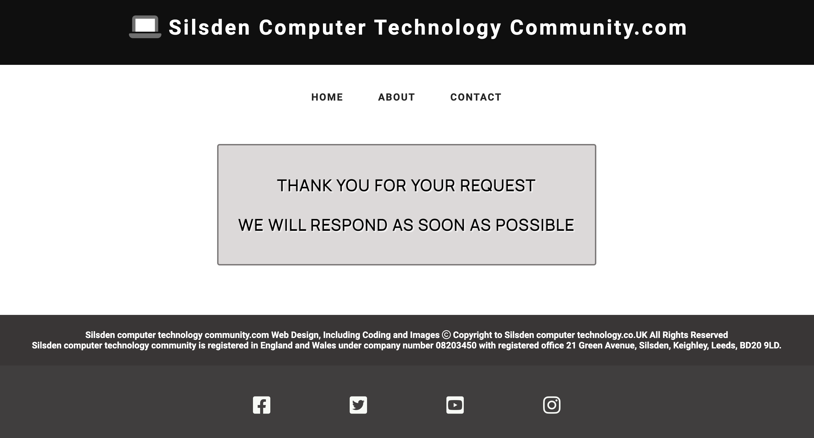

## Technologies Used

- HTML was used as the foundation of the site.
- CSS - was used to add the styles and layout of the site.
- CSS Flexbox - was used to arrange items symmetrically on the pages.
- CSS Grid - was used to make "gallery" and "contact" pages responsive.
- Balsamiq was used to make wireframes for the website.
- VSCode was used as the practice tool to write and edit code.
- Git was used for the version control of the website.
- Gitpod was used as the primary tool to write and edit the website.
- GitHub was used to host the principle of the website.
- tinyPNG was used to make and resize images for the README file.

## DESIGN

- Color Scheme
  The grey,black and white colour was used as the main colour of the website due to its psychological effect on people's minds. As this colour is associated with trustworthiness and reliability, website visitors could build a firm belief in the organization "Silsden computer technology community."

White Color was used as a background shadow colour since this colour creates a sense of tranquillity and certainty that connects the user and the organization.

The black colour was used to emphasize the logo and header since this colour creates a sense of power, elegance, and formality and leaves A great impact on website visitors.

The grey colour was used for the background and text according to the hero picture The grey colour was used for the background and text according to the hero picture and to contrast the text. This colour creates a sense of intellect, knowledge, and wisdom and leaves a remarkable effect on website visitors.

The orange colour was used to emphasize the border and hover since this colour creates a sense of energy and visibility to help to navigate the visitors.

- Typography
  Lato roboto Google Font was used as the website's primary font to increase the content's readability.

Manrope Google Font was used to attract viewers' attention to the cover text, accentuate the company's strong points, and incentivize visitors to contact "Silsden computer technology" community.

- Wireframes
  - Mobile devices
    - Home Page. Mobile Screen
    - About Page. Mobile Screen
    - Contact Page. Mobile Screen
    - Response Page. Mobile Screen
  - Tablets
  - Home Page. Tablet Screen
  - About Page. Tablet Screen
  - Contact Page. Tablet Screen
  - Response Page. Tablet Screen
  - Desktop
  - Home Page. Desktop Screen
  - About Page. Desktop Screen
  - Contact Page. Desktop Screen
  - Response Page. Desktop Screen

## TESTING

To confirm the correct functionality, responsiveness, and appearance:
The website was tested on the following browsers: Chrome, Firefox, and Brave.
Chrome:

- Chrome
  
  
- Firefox
  
- Brave
  
  The website was checked by dev tools implemented in Firefox and Chrome browsers.
- Main Page:
  
- About Page
  
- Sign Up Page
  
  The website was checked with Responsive Website Design Tester.
- Desktop-Screens:
  
- Laptop-Screens
  
- Mobile-Screens
  
  Validator testing
  

## MANUAL TESTING

| FEATURE                                                                        | ACTION                                                             | EXPECTED RESULT                              | TESTED | PASSED | COMMENTS |
| :----------------------------------------------------------------------------- | :----------------------------------------------------------------- | :------------------------------------------- | :----- | :----- | :------- |
| Logo                                                                           | Click on the "LOGO"link                                            | The user is redirected to the main page      | Yes    | Yes    | -        |
| Navbar                                                                         |                                                                    |                                              |        |        |          |
| Home                                                                           | Click on the "HOME"link                                            | The user is redirected to the main page      | Yes    | Yes    | -        |
| Contact                                                                        | Click on the "CONTACT"link                                         | The user is redirected to the contact page   | Yes    | Yes    | -        |
| About                                                                          | Click on the "ABOUT"link                                           | The user is redirected to the about page     | Yes    | Yes    | -        |
| Footer                                                                         |                                                                    |                                              |        |        |          |
| Facebook icon in the footer                                                    | Click on the facebook icon                                         | The user is redirected to the facebook page  | Yes    | Yes    | -        |
| Twitter icon in the footer                                                     | Click on the twitter icon                                          | The user is redirected to the twitter page   | Yes    | Yes    | -        |
| Youtube icon in the footer                                                     | Click on the youtube icon                                          | The user is redirected to the youtube page   | Yes    | Yes    | -        |
| Instagram icon in the footer                                                   | Click on the instagram icon                                        | The user is redirected to the instagram page | Yes    | Yes    | -        |
| About page                                                                     |                                                                    |                                              |        |        |          |
| Logo                                                                           | Click on the "LOGO"link                                            | The user is redirected to the main page      | Yes    | Yes    | -        |
| Home                                                                           | Click on the "HOME"link                                            | The user is redirected to the main page      | Yes    | Yes    | -        |
| Contact                                                                        | Click on the "CONTACT"link                                         | The user is redirected to the contact page   | Yes    | Yes    | -        |
| About                                                                          | Click on the "ABOUT"link                                           | The user is redirected to the about page     | Yes    | Yes    | -        |
| Contact page                                                                   |                                                                    |                                              |        |        |          |
| Full Name input                                                                | Enter The first name                                               | The full name is entered                     | Yes    | Yes    | -        |
| Email Address input                                                            | Enter The email address                                            | The email address is entered                 | Yes    | Yes    | -        |
| Gender checkbox                                                                | Click on the gender checkbox                                       | The checkbox is checked                      | Yes    | Yes    | -        |
| Tell us about your required and your experience with computers text area input | Enter The required and experience with computer in text area input | The text is entered                          | Yes    | Yes    | -        |
| Summit Button                                                                  | Click on the "Submit" button                                       | The user is redirect to the response page    | Yes    | Yes    | -        |
| Response page                                                                  |                                                                    |                                              |        |        |          |
| Logo                                                                           | Click on the "LOGO"link                                            | The user is redirected to the main page      | Yes    | Yes    | -        |
| Home                                                                           | Click on the "HOME"link                                            | The user is redirected to the main page      | Yes    | Yes    | -        |
| Contact                                                                        | Click on the "CONTACT"link                                         | The user is redirected to the contact page   | Yes    | Yes    | -        |
| About                                                                          | Click on the "ABOUT"link                                           | The user is redirected to the about page     | Yes    | Yes    | -        |

HTML
Home Page
No errors or warnings were found when passing through the official W3C validator.

About Page
No errors or warnings were found when passing through the official W3C validator.

Contact Page
No errors or warnings were found when passing through the official W3C validator.
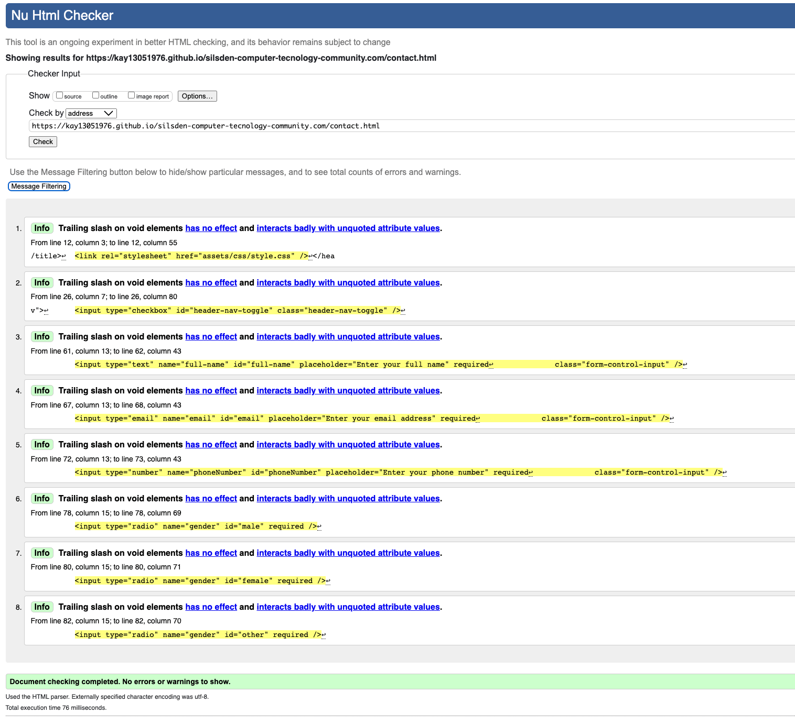
Response Page
No errors or warnings were found when passing through the official W3C (Jigsaw) validator except:

No errors or warnings were found when passing through the official W3C validator.
CSS

Accessibility and performance
Using lighthouse in dev tools, I confirmed that the website is performing well, is accessible, and the colours and fonts chosen are readable.

- Home page
  
- About page
  
- Contact page
  
- Response page
  
  ## Deployment
  The site was deployed to GitHub pages. The steps to deploy are as follows:
  In the [GitHub repository](https://github.com/Kay13051976/silsden-computer-tecnology-community.com) navigate to the Settings tab
  From the source section drop-down menu, select the Main Branch, then click "Save".
  The page will be automatically refreshed with a detailed ribbon display to indicate the successful deployment.
  The live link can be found here
  ## Local Deployment
  In order to make a local copy of this project, you can clone it. In your IDE Terminal, type the following command to clone my repository:
  git clone https://github.com/Kay13051976/silsden-computer-tecnology-community.com
  Alternatively, if you use Gitpod, you can click 
   [here](https://kay13051976.github.io/silsden-computer-tecnology-community.com/)
   to start the Gitpod workspace.
### Future improvements 
  - improve performance
  - improve the quality of the message
  - add more animation on css style.
### Credits
- Content 
  - Inspiration for the responsive hamberger navbar from Kevin Powell on his YouTube channel
  - Inspiration for the README.md file form my mentor Juliia Konovalova
- Media
 - All the images for the website were taken from Pixabay, 
  Unsplash
 - Hero image
   - [a link](https://pixabay.com/photos/startup-start-up-people-593341/)
   - [a link](https://www.istockphoto.com/photo/small-startup-business-team-photo-gm1063813062-284419593?clarity=false)
- Main icons images take from https://fontawesome.com
- Testimonial Section
   - [a link](https://pixabay.com/photos/portrait-outdoor-smiling-developer-2132190/)
   - [a link](https://pixabay.com/photos/laptop-apple-macbook-computer-2561018/)
   - [a link](https://pixabay.com/photos/laptop-apple-macbook-computer-2561505/)

- Activity images
   - [a link](https://pixabay.com/photos/startup-meeting-brainstorming-594090/)
   - [a link](https://unsplash.com/photos/GkraTrCYA_0)
   - [a link](https://unsplash.com/photos/woman-sitting-on-brown-wooden-chair-while-using-silver-laptop-computer-in-room-WHWYBmtn3_0)
   - [a link](https://pixabay.com/photos/children-win-success-video-game-593313/)
   - [a link](https://pixabay.com/photos/laptops-meeting-businessmen-593296/)
    - [a link]()
    - [a link]()
    - [a link]()
    - [a link]()

    - [a link]()

- Tools
  - [TinyPNG](https://tinypng.com/) was used to compress JPEG image.
  - https://coolors.co/ was used to create the color palette.
  - https://imagecolorpicker.com/en picker was used to pick the colour.
  - https://icolorpalette.com/ use to create the colour image.
  
- Acknowledgments
  - Code Institute tutor and Slack community members for their
  support and help.
  - Kevin Powell for his amazing CSS tutorials
  - Kong Raksiam for his amazing HTML and CSS tutorials
  - Code Institute mentor Juliia Konovalova for her patient and
  answer my question event on the her day off.

## WIREFRAMES MOBILE DEVICE

