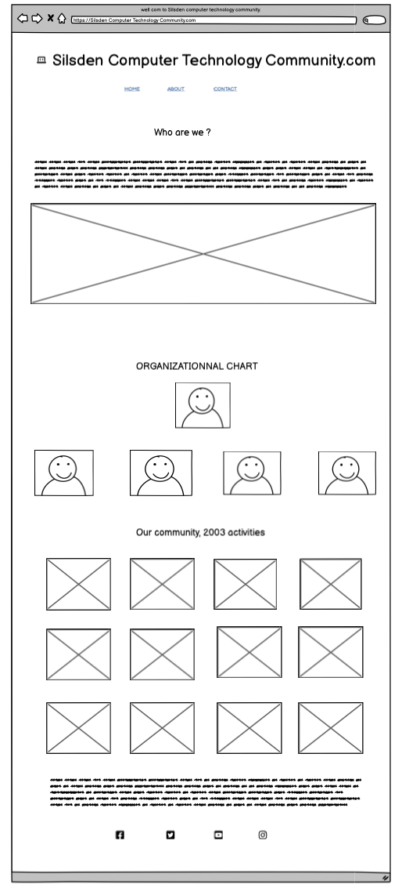

# Silsden computer technology community.com
Silsden computer technology community.com is the website for people living in Silsden to support anybody interested in computer technology. Our primary purpose is to open the gate and connect them to the correct link and support. We also introduce computer technology to the community with the event and free study class for the beginner.

The site can be accessed by the link [a link](https://kay13051976.github.io/silsden-computer-tecnology-community.com/)

## Use Stories
First-Time Visitor Goals:
- As a First-Time Visitor, I want to quickly understand the site's primary purpose to learn more about the organization.
- As a first-time visitor, I want to navigate the website to find the content easily.
- As a First Time Visitor, I want to see the testimonials to see whether the organization is trustworthy.
- As a first-time visitor, I want to get in touch easily.

Returning Visitor Goals:
-I want to see various support choices, events, and courses as a Returning Visitor.
- As a Returning Visitor, I want to see information about technology and link to the appropriate study website and event, support choices, Tech career opportunities and make decisions.

Frequent Visitor Goals:
- As a Frequent User, I want to check for any changes with an available course, event, or computer technology news, IT job requirements
- As a Frequent User, I want options for contacting the organization to get a career opportunity

## wireframes 
Wireframes 
Desktop

## logo

## features
   ### navbar
   #### navigation
   
  - Position at the top underneath the logo.
    * Home : Lead to the home page, where the user can learn about the organization.
    * About : Lead to the About page where the user can see the purpose of this organization and all the staff, including the community activities gallery of the years.
    * Contact : Lead to the home page, where the user can see the contact address and social link.
    * Sign Up : Lead to the form page where the user can sign up to get in touch with the organization
    
     **The navigation bar is straightforward to understand for the user  and responsive**
     
     - **on macbook**
      
     - **on on mobile devices**
      navigation bar filled with the logo in the center and a hamburger menu with the links in the same order.
      
      When the hamburger menu is clicked, there is dropdown menu with the link in the same order.
      

     - **on desktop**

     ## home page
     - Represent : The home page represents the purpose of the organization and shows feedback from satisfied clients, a weekly agenda, a contact address, and a social link, including sponsored

     <!-- homepage picture -->
     
